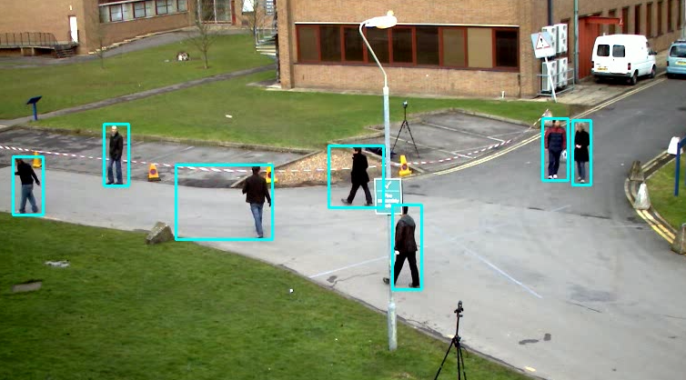
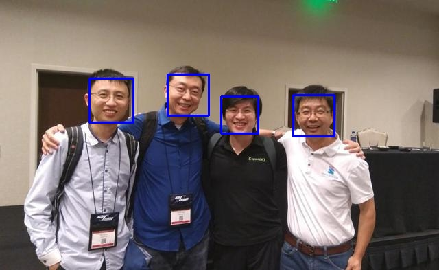
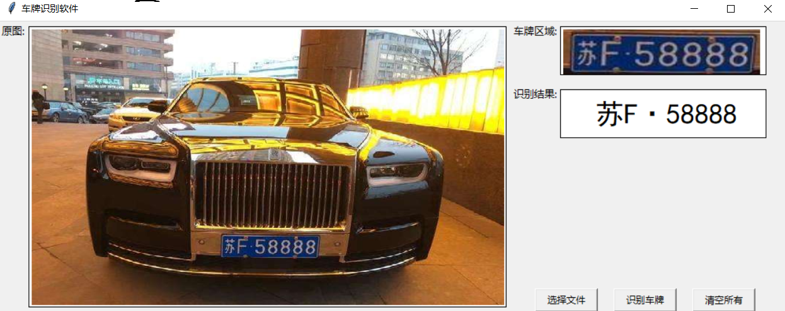
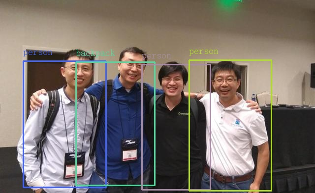

# paper4SecondDegree-
二学位论文代码（太原理工大学计算机科学与技术学院）
---

## 基于嵌入式和OpenCV技术的智能监控系统设计与实现

### 代码结构
- src/* 为资源文件
- OpenCV 运动目标检测代码部分
    - mogDemo ：基于openCV MOG2背景差分法动态目标检测
    
    - track_video: 根据滑动条设置HSV的阈值进行视频流的颜色的追踪
    - face.py: 基于人脸级联分类器引擎实现的人脸识别
    
- dense/ 基于tensorflow2.x版本搭建的**全连接**深度学习网络
    
    - car_dataset 训练用的数据集，包括测试集和数据集
     
    - *.h5 为训练好神经网络保存的模型权重的文件
    - license_plate_recognition.py 基于tkinter实现车牌识别系统的gui界面
    - *.ipynb 为jupyter notebook 沉浸式笔记搭建Dense网络的过程，详细可查看pdf文件
    
- yolov3（OpenCV实现）
   
   - model/* 为yolov3 神经网络CNN卷积层定义配置，还有训练好的模型权重
   - chinese_code 为openCV提供了中文标签的支持工具
   
    
    
### 参考代码github库

https://github.com/iArunava/YOLOv3-Object-Detection-with-OpenCV.git
https://github.com/duanshengliu/License-plate-recognition-demo.git

---
论文答辩完毕，演示也有点糟糕，因为室友的电脑vga接口问题无法演示。
加油送给自己，谢谢答辩的那位女老师，谢谢耐心听我演示，以及没有完成的答辩。
最近因为一些事情，好多东西没有准备好，谢谢，之后一定好好完善剩下的部分
TODO: 机器视觉;更深的研究深度学习网络；认真踏实；努力
不管怎么说，自己本科生涯结束了，虽说有点遗憾，也是怪我努力的不够多；呜呜呜，加油，谢谢那位老师，
语音识别我有空的接触一下，谢谢你可以耐心的听我讲代码；
**take is easy, show me the code;**
